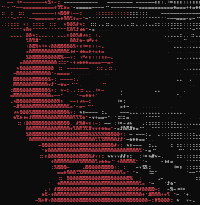

<h2>Hello , I'm Waqib Sk</h2>

   
  

  <strong style="font-size: 12px;">
    I am an undergraduate from IIT Kharagpur ('28 batch).  
    I am  interested in learning about software development 
    and creating impactful projects.
  </strong>

